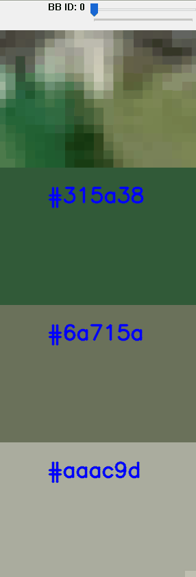
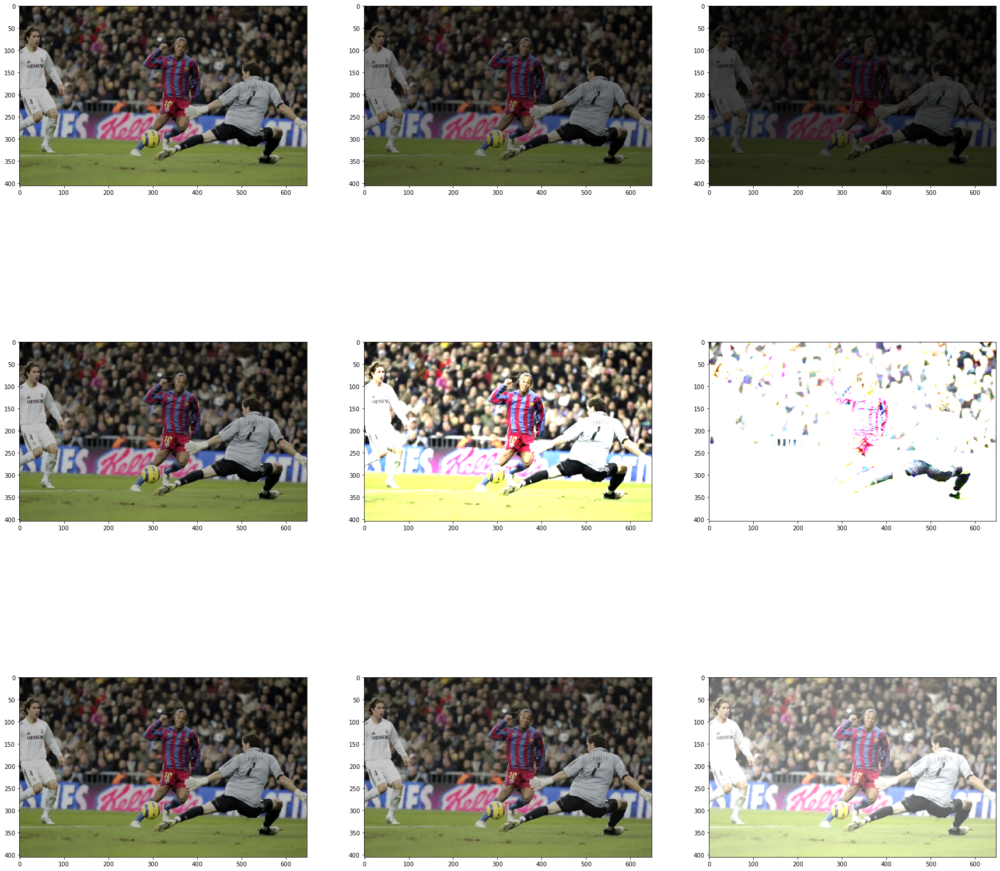
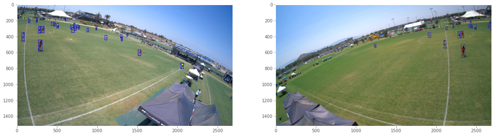
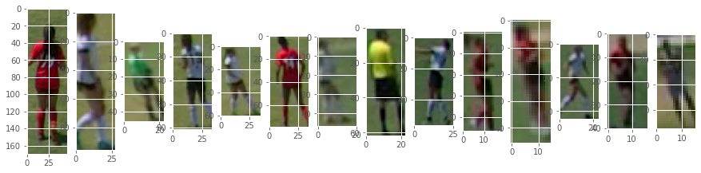
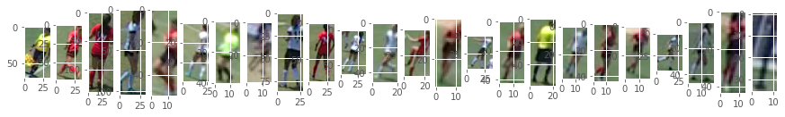
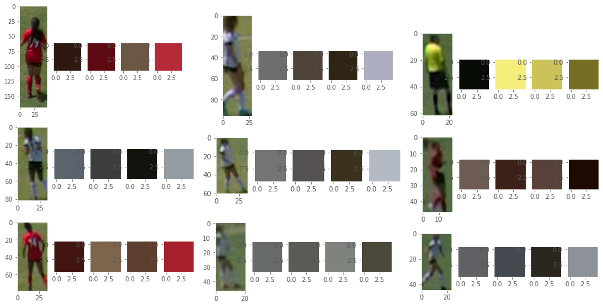

# KMeans-Clustering-To-Get-Player-Jersey-Colors

This is a project I did where I took video footage from soccer games coupled with predetermined bounding boxes and use that information to create an algorithm that would determine the player jersey color.

